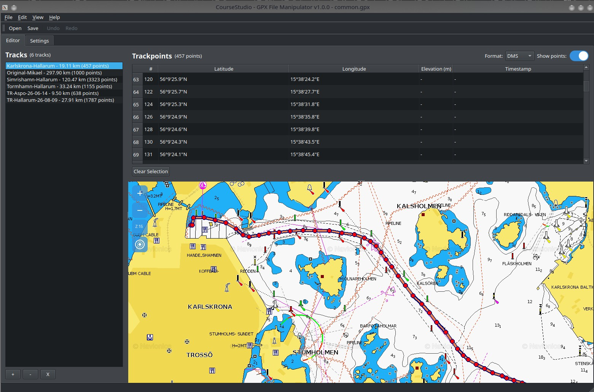
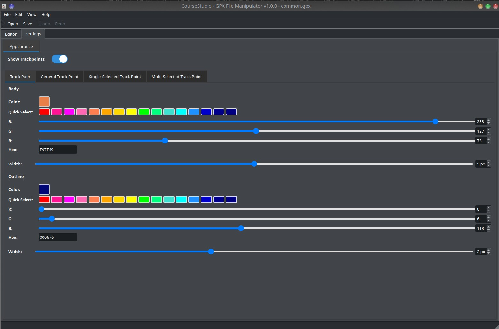

# CourseStudio - GPX File Manipulator

A PyQt5-based desktop application for viewing, editing, and manipulating GPX (GPS Exchange Format) files with interactive map visualization. Designed for marine navigation and track management with support for Garmin GPS devices.

### Screenshots

**Editor Tab - Main Interface**



The main interface showing the track list on the left, trackpoints in the center, and interactive map with pan/zoom controls.

**Settings Tab - Appearance Configuration**



Customize track colors, point sizes, and other visual properties with real-time map updates.

## Features

### Core Functionality
- **GPX File Management**
  - Load, edit, and save GPX files
  - Support for multiple tracks in a single file
  - Undo/redo support for all edits
  - Backup creation before saving
  - Batch processing capabilities

- **Track Visualization**
  - Interactive map with mbtiles-based tile support
  - Real-time track rendering
  - Pan and zoom controls
  - Track path color and width customization with outline effects

- **Trackpoint Management**
  - View all trackpoints in tabular format
  - DMS (Degrees, Minutes, Seconds) and Decimal coordinate formats
  - Toggle between formats instantly
  - Track elevation and timestamp data (when available)

- **Map Navigation**
  - Smooth panning with Web Mercator projection
  - Mouse wheel zoom support
  - Zoom in/out buttons with visual feedback
  - Recenter to default position
  - Turning points (trackpoints) visualization on map with customizable outline

- **Turning Points Display**
  - Visualize trackpoints as circles on the map
  - Toggle visibility with toggle switch
  - Customizable colors and sizes for general, single-selected, and multi-selected points
  - Configurable outline colors and widths
  - Selected point highlighting

- **Layout Control**
  - Horizontal splitter between Track List and Trackpoints/Map panel (manually resizable)
  - Vertical splitter between Trackpoints list and Map (manually resizable)
  - Expand/collapse sections without losing work

- **Settings Panel**
  - **Appearance tab** with sub-tabs:
    - Track Path: Configure body and outline colors/widths
    - General Track Point: Settings for unselected trackpoints
    - Single-Selected Track Point: Settings for single-selected trackpoints
    - Multi-Selected Track Point: Settings for multi-selected trackpoints
  - Real-time map updates when settings change
  - Auto-save configuration to file

## Requirements

### System Requirements
- Python 3.8+
- PyQt5
- PIL (Pillow)
- GPXpy
- Configparser

### Recommended Hardware
- Linux/macOS/Windows
- Minimum 4GB RAM
- 100MB disk space for mbtiles data

## Installation

### Quick Start

1. **Clone the repository**
```bash
git clone https://github.com/yourusername/CourseStudio.git
cd CourseStudio
```

2. **Create virtual environment**
```bash
python3 -m venv venv
source venv/bin/activate  # On Windows: venv\Scripts\activate
```

3. **Install dependencies**
```bash
pip install -r requirements.txt
```

4. **Run the application**
```bash
python src/main.py
```

### Development Setup

```bash
# Install with development dependencies
pip install -r requirements-dev.txt

# Run tests
pytest tests/

# Run with debug logging
python src/main.py --debug
```

## Usage

### Opening a GPX File

1. Click **File → Open** or use Ctrl+O
2. Select your GPX file
3. File contents load into the Tracks and Trackpoints panels

### Viewing Tracks on Map

1. Select a track from the **Tracks** list on the left
2. Track path appears on the map in **red (configurable)**
3. All trackpoints appear as **yellow circles** (if "Show points" = Yes)
4. Click on a trackpoint in the **Trackpoints** list to highlight it in **blue**

### Map Controls

| Action | Control |
|--------|---------|
| Pan | Left-click and drag |
| Zoom In | Click **+** button or scroll wheel up |
| Zoom Out | Click **-** button or scroll wheel down |
| Recenter | Click **⊙** button |
| Toggle Points | Use **"Show points"** dropdown in Trackpoints window |

### Coordinate Formats

**DMS (Degrees, Minutes, Seconds)**
```
57°30'45.5"N 12°15'30.2"E
```

**Decimal**
```
57.5126°N 12.2584°E
```

Switch between formats using the **Format** dropdown in the Trackpoints window.

### Customizing Appearance

Edit `config/settings.ini`:

```ini
[Map]
# Track path color (hex RRGGBB)
track_path_color = FF0000          # Red
track_path_width = 3               # 3 pixels

# Turning points (trackpoints)
show_turning_points = true         # Show/hide all points
turning_point_color = FFFF00       # Yellow
selected_turning_point_color = 0000FF  # Blue
turning_point_size = 4             # 4 pixel radius
```

### Supported Coordinate Formats

- **DMS**: Degrees, Minutes, Seconds (57°30'45.5"N)
- **Decimal**: Decimal degrees (57.5126°)

Change format in Trackpoints window using the **Format** dropdown.

## Architecture

### Directory Structure

```
CourseStudio/
├── src/
│   ├── main.py                    # Application entry point
│   ├── core/
│   │   ├── track_manager.py       # GPX data management
│   │   ├── gpx_handler.py         # GPX parsing
│   │   └── calculator.py          # Distance/math utilities
│   ├── gui/
│   │   ├── main_window.py         # Main application window
│   │   └── widgets/
│   │       ├── map_widget.py      # Interactive map display
│   │       ├── track_list_widget.py      # Track list UI
│   │       └── trackpoint_list_widget.py # Trackpoint list UI
│   └── map/
│       ├── map_renderer.py        # Tile rendering
│       ├── mbtiles_provider.py    # MBTiles data source
│       └── tile_server.py         # Tile management
├── config/
│   ├── settings.ini               # Configuration file
│   └── app_config.py              # Config loader
├── mbtiles/
│   └── Sweden-Raster-Z10-Z16.mbtiles  # Sample tile data
├── tests/
│   ├── test_*.py                  # Unit tests
│   └── gpx/
│       └── *.gpx                  # Sample GPX files
├── doc/
│   ├── STEP11_COMPLETION.md       # Map navigation docs
│   ├── ARCHITECTURE.md            # System architecture
│   └── CONFIGURATION_GUIDE.md     # Configuration help
├── requirements.txt               # Python dependencies
└── README.md                      # This file
```

### Key Classes

**MainWindow** (`src/gui/main_window.py`)
- Main application window
- File operations (open, save, close)
- Signal coordination between widgets
- Menu and toolbar management

**MapWidget** (`src/gui/widgets/map_widget.py`)
- Interactive map rendering
- Pan and zoom handling
- Track visualization
- Web Mercator projection for accurate positioning

**TrackManager** (`src/core/track_manager.py`)
- Load/save GPX files
- Track and trackpoint management
- Undo/redo support
- Distance calculations

**TrackListWidget** (`src/gui/widgets/track_list_widget.py`)
- Display all tracks
- Track selection
- Track metadata display

**TrackpointListWidget** (`src/gui/widgets/trackpoint_list_widget.py`)
- Display trackpoints for selected track
- Coordinate format conversion
- Trackpoint selection
- Show/hide points toggle

## Map Data

### Tile Support

CourseStudio uses MBTiles format for map data. Included:
- **Sweden-Raster-Z10-Z16.mbtiles**: Raster tiles for Swedish archipelago

To use different map data:
1. Place `.mbtiles` file in `mbtiles/` directory
2. Update `config/settings.ini` with filename
3. Restart application

### Tile Specifications

| Property | Value |
|----------|-------|
| Format | MBTiles (SQLite) |
| Tile Size | 256×256 pixels |
| Projection | Web Mercator (EPSG:3857) |
| Zoom Levels | Varies by tileset |

## Configuration

### settings.ini Sections

**[Application]**
- `app_name`: Application name (default: CourseStudio)
- `version`: Version string
- `debug`: Enable debug logging

**[Map]**
- `default_mbtiles`: Primary tile file
- `fallback_mbtiles`: Fallback options
- `initial_zoom_level`: Default zoom on startup
- `track_path_color`: Track line color (hex)
- `track_path_width`: Track line width (pixels)
- `turning_point_color`: Trackpoint color (hex)
- `selected_turning_point_color`: Selected trackpoint color (hex)
- `turning_point_size`: Trackpoint radius (pixels)

**[Coordinates]**
- `coordinate_format`: Default format (dms/decimal)
- `decimal_places`: Decimal precision
- `dms_seconds_decimals`: DMS seconds precision

**[Performance]**
- `max_trackpoints_no_warning`: Warning threshold
- `max_file_size_warning`: File size warning (MB)
- `max_undo_redo_stack_size`: Undo history size

**[Logging]**
- `log_level`: Logging verbosity (DEBUG/INFO/WARNING/ERROR/CRITICAL)
- `log_file`: Log file path

See `config/settings.ini` for complete list of options.

## Testing

### Run All Tests

```bash
pytest tests/ -v
```

### Run Specific Test Suite

```bash
# Track manager tests
pytest tests/test_track_manager.py -v

# Map widget tests
pytest tests/test_map_widget.py -v

# Configuration tests
pytest tests/test_app_config.py -v
```

### Test Coverage

```bash
pytest tests/ --cov=src --cov-report=html
# Open htmlcov/index.html for coverage report
```

## Development

### Code Style

- Follow PEP 8
- Use meaningful variable names
- Document functions with docstrings
- Include type hints for function parameters

### Adding New Features

1. Create feature branch: `git checkout -b feature/your-feature`
2. Implement feature with tests
3. Ensure all tests pass: `pytest tests/`
4. Submit pull request

### Project Structure

- `src/core/`: Business logic (GPX handling, calculations)
- `src/gui/`: User interface (PyQt5 widgets)
- `src/map/`: Map rendering and tile management
- `config/`: Configuration management
- `tests/`: Unit and integration tests
- `doc/`: Documentation

## Known Limitations

- **Single Tile Set**: Currently displays one tileset at a time
- **Single Zoom Level**: Sweden-Raster-Z10-Z16 supports only zoom 15 (use full tileset for Z10-Z16)
- **One Track Visible**: Only one track displays at a time (by design - prevents clutter)
- **No Track Import/Export**: Can't copy tracks between files yet

## Recent Fixes (Version 1.1.0)

### Track Deletion Behavior
- **Before**: Deleting the last point in a track would auto-select and display another track, causing confusion
- **After**: Deleting a track leaves no track selected - the trackpoint list and map are empty until you select another track

### Trackpoint Deletion Updates
- **Before**: Deleting trackpoints didn't update the track info (distance, point count) in the track list
- **After**: Track info updates dynamically after any trackpoint deletion

### Auto-Track Creation
- **Before**: You could only add points to an empty file if you opened it fresh, not if you deleted all tracks
- **After**: Adding points to the map when no track is selected creates a new track (consistent behavior)

## Future Enhancements

- [ ] Multi-track visualization on map
- [ ] Track comparison tools
- [ ] Waypoint management
- [ ] Route planning
- [ ] Advanced filtering and search
- [ ] Export to KML, GPX with compression
- [ ] Mobile app companion
- [ ] Cloud sync support

## Contributing

Contributions are welcome! Please:

1. Fork the repository
2. Create a feature branch
3. Add tests for new features
4. Ensure all tests pass
5. Submit a pull request

## License

[Your License Here] - See LICENSE file for details

## Support & Documentation

- **Bug Reports**: Open an issue on GitHub
- **Documentation**: See `doc/` directory
- **Configuration**: See `config/settings.ini` for all options
- **Architecture**: See `doc/ARCHITECTURE.md`

## Author

Mikael - Initial development and design

## Changelog

### Version 1.1.0 (2026-10-02)

**Bug Fixes & Improvements:**
- ✅ Fixed track deletion behavior: Deleting last point in a track no longer auto-selects other tracks
- ✅ Fixed trackpoint deletion: Track info (distance, point count) now updates dynamically when deleting points
- ✅ Improved track/trackpoint creation: Auto-creates new track when no track is selected and points are added (consistent with startup behavior)
- ✅ Fixed UI synchronization: Track list, trackpoint list, and map now properly stay in sync when deleting tracks/points
- ✅ Trackpoint info updates on deletion:
  - Single point deletion updates track info
  - Range deletion from start updates track info
  - Range deletion from end updates track info

**Track Management Behavior:**
- When no track is selected (empty file or after deletion), adding points creates a new track automatically
- Deleting a track leaves no selection (instead of auto-selecting next track)
- Deleting the last point in a track deletes the entire track
- All deletions support undo (Ctrl+Z)

### Version 1.0.0 (2026-09-20)

**Implemented Features:**
- ✅ GPX file loading and basic editing
- ✅ Interactive map with pan/zoom
- ✅ Track visualization with configurable colors
- ✅ Trackpoint display and management
- ✅ Coordinate format conversion (DMS/Decimal)
- ✅ Undo/redo support
- ✅ Configuration file system
- ✅ Web Mercator projection for accurate panning
- ✅ Turning points (trackpoints) visualization
- ✅ Show/hide points toggle

**Known Issues:**
- Zoom limited to available levels in tileset
- Single track visible at a time (by design)

## Quick Reference

| Task | How To |
|------|-------|
| Open GPX | File → Open or Ctrl+O |
| Save GPX | File → Save or Ctrl+S |
| View Track | Click track name in left panel |
| View Points | Auto-loads when track selected |
| Change Format | Use Format dropdown in Trackpoints |
| Toggle Points | Use Show points dropdown |
| Pan Map | Left-click and drag |
| Zoom | Use buttons or mouse wheel |
| Recenter Map | Click ⊙ button |

## Documentation & Guides

### User Documentation
- **[USER_GUIDE.md](doc/USER_GUIDE.md)** - Complete user guide with all features
  - Opening and saving files
  - Map navigation (zooming, panning)
  - Layout control with splitter handles
  - Track and trackpoint management
  - Coordinate formats
  - Undo/redo
  - All keyboard shortcuts

- **[QUICK_REFERENCE.md](doc/QUICK_REFERENCE.md)** - Quick reference for common tasks
  - ⭐ **Mouse wheel zooming** (cursor-centered)
  - **Splitter handle** (resize panels)
  - Quick tips and workflows
  - Keyboard shortcuts cheat sheet

### Developer Documentation
- **[ARCHITECTURE.md](doc/ARCHITECTURE.md)** - System architecture and design
- **[CONFIGURATION_GUIDE.md](doc/CONFIGURATION_GUIDE.md)** - Configuration options

## System Requirements

- **OS**: Linux, macOS, or Windows
- **Python**: 3.8 or higher
- **RAM**: 4GB minimum
- **Display**: 1280×900 minimum resolution
- **Storage**: 100MB for application and sample data

## Performance Tips

- Keep tracks under 5000 trackpoints for smooth performance
- Use reasonable zoom levels (Z10-Z16)
- Enable "Show points: No" for large tracks to improve responsiveness
- Close unused files to free memory

## Troubleshooting

### Application Won't Start
```bash
# Check Python version
python3 --version  # Should be 3.8+

# Verify dependencies
pip list | grep -E "PyQt5|Pillow|gpxpy"

# Run with debug output
python src/main.py --debug
```

### Map Won't Display
- Verify mbtiles file exists in `mbtiles/` directory
- Check `config/settings.ini` for correct filename
- Ensure coordinate format is valid (DMS or Decimal)
- Check logs in `CourseStudio.log`

### Performance Issues
- Reduce number of visible points ("Show points: No")
- Switch to simpler tileset (fewer zoom levels)
- Close other applications to free RAM
- Check system resources with `htop` or Task Manager

## Contact & Community

- Issues & Bug Reports: GitHub Issues
- Feature Requests: GitHub Discussions
- Questions: GitHub Discussions or Issues
- **User Guide**: See [USER_GUIDE.md](doc/USER_GUIDE.md) for detailed help

---

**CourseStudio** - Making GPS data management simple and visual.
